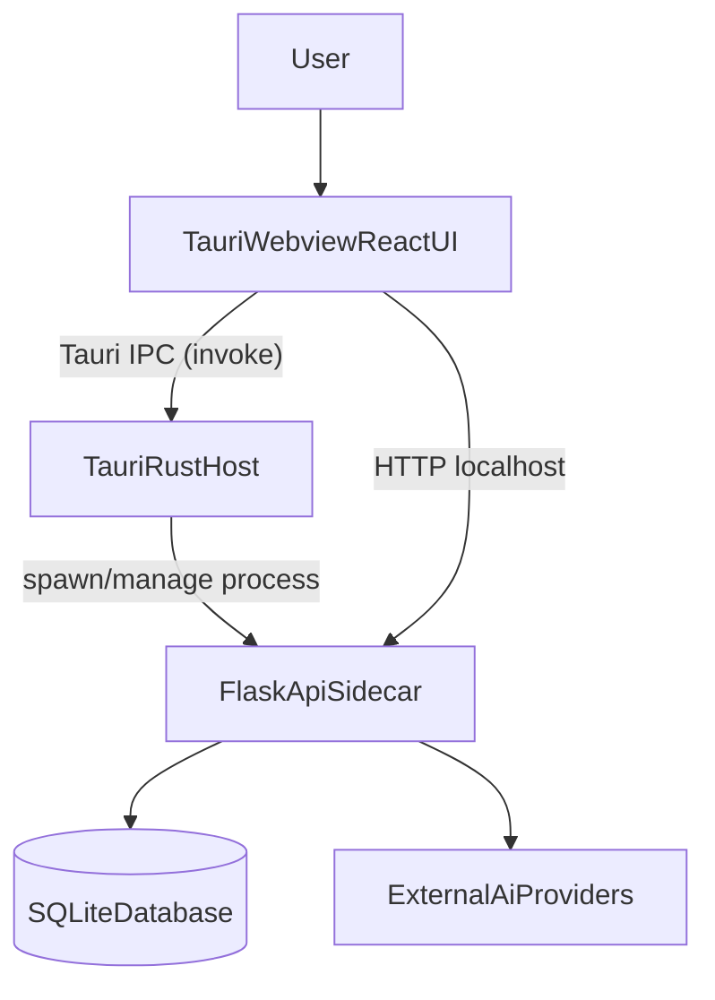
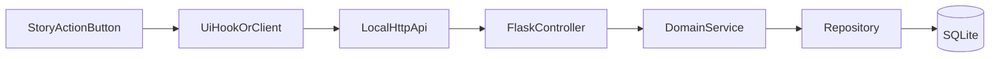

# Architecture

This project combines a React UI, a Tauri host, and a Flask API sidecar.
The desktop product experience depends on all three layers working together.

## System context

## Runtime responsibilities

### React UI (`src/`)

- Renders conversations, story actions, and settings panels.
- Uses Redux Toolkit and custom hooks for app state and orchestration.
- Calls Flask APIs for story generation, settings, summaries, and persistence.

### Tauri host (`src-tauri/`)

- Owns desktop window lifecycle and app process behavior.
- Starts and stops the Python sidecar process.
- Exposes native capabilities through IPC commands.
- Handles desktop-only concerns such as tray, updater, and diagnostics.

### Flask API (`server/src/`)

- Exposes local REST endpoints consumed by the desktop UI.
- Applies layered architecture: controller -> service -> repository.
- Uses SQLite for local persistence and talks to AI providers.
- Enforces API auth/session ownership constraints for process safety.

## Request path for story actions

## Desktop startup and shutdown model

1. Tauri app launches and initializes plugins.
2. Rust side starts the Python server process.
3. UI discovers server status and uses dynamic/local port behavior.
4. During app exit, Rust triggers graceful Flask shutdown when possible.
5. App exits after cleanup completes or fallback path is reached.

## Boundary rules for contributors

- UI behavior belongs in `src/` hooks/components, not in Rust.
- Native process control belongs in Rust, not in frontend JavaScript.
- Business decisions and data persistence belong in Flask services/repositories.
- Keep contracts stable across boundaries (IPC payloads, HTTP schemas, DB assumptions).

## Related docs

- Development flow: [`development.md`](./development.md)
- Testing flow: [`testing.md`](./testing.md)
- Packaging flow: [`build-and-release.md`](./build-and-release.md)
