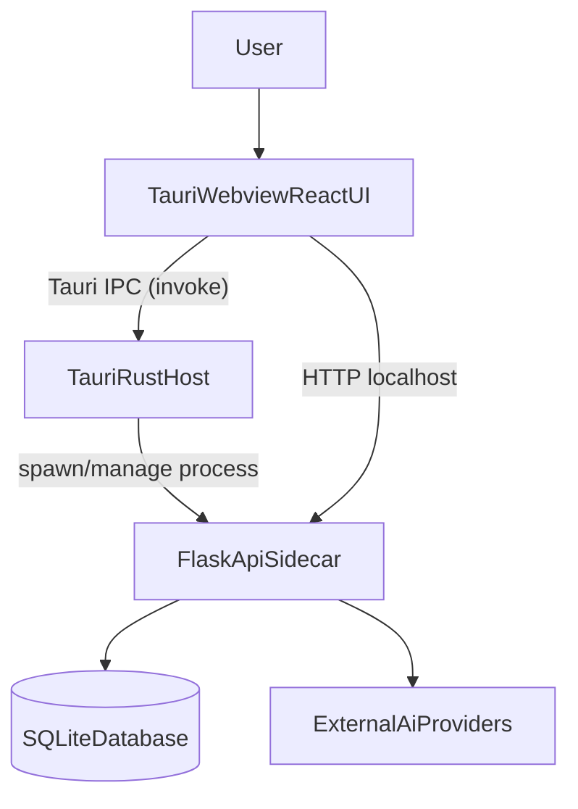
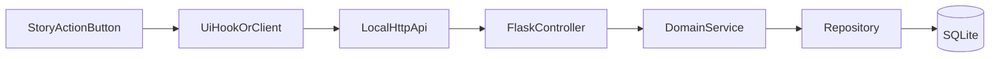

# Architecture

This project combines a React UI, a Tauri host, and a Flask API sidecar.
The desktop product experience depends on all three layers working together.

## System context

## Runtime responsibilities

### React UI (`src/`)

- Renders conversations, story actions, and settings panels.
- Uses Redux Toolkit and custom hooks for app state and orchestration.
- Calls Flask APIs for story generation, settings, summaries, and persistence.

### Tauri host (`src-tauri/`)

- Owns desktop window lifecycle and app process behavior.
- Starts and stops the Python sidecar process.
- Exposes native capabilities through IPC commands.
- Handles desktop-only concerns such as tray, updater, and diagnostics.

### Flask API (`server/src/`)

- Exposes local REST endpoints consumed by the desktop UI.
- Applies layered architecture: controller -> service -> repository.
- Uses SQLite for local persistence and talks to AI providers.
- Enforces API auth/session ownership constraints for process safety.

## Request path for story actions

## Desktop startup and shutdown model

1. Tauri app launches and initializes plugins.
2. Rust side starts the Python server process.
3. UI discovers server status and uses dynamic/local port behavior.
4. During app exit, Rust triggers graceful Flask shutdown when possible.
5. App exits after cleanup completes or fallback path is reached.

## SQLite schema versioning and chat extensions

Local chat data uses SQLite with `PRAGMA user_version` driven migrations in `server/src/infrastructure/schema_migrations.py`.

- **`SCHEMA_USER_VERSION`**: the codebase target is **3**; `apply_schema_migrations` runs steps from low to high at startup. The app **does not downgrade** a database file whose `user_version` is already higher.
- **Version 3 (Phase A contract)** adds nullable columns on `chat_records`: `content_type`, `attachment_ref`, `branch_id`, `savepoint_id`, `ending_tag`; and creates `story_branches`, `story_savepoints`, `story_endings`, `media_assets` with indexes.

### HTTP: branches, savepoints, endings (`ChatController`)

| Method | Path | Purpose |
| --- | --- | --- |
| `GET` | `/api/story/branches` | List branch metadata for a conversation |
| `POST` | `/api/story/branches` | Create a branch |
| `GET` | `/api/story/savepoint` | List savepoints |
| `POST` | `/api/story/savepoint` | Create a savepoint |
| `GET` | `/api/story/ending` | List ending markers |
| `POST` | `/api/story/ending` | Mark an ending |

Query string or JSON body must include `conversation_id` (same as other conversation APIs).

### HTTP: chat and multi-part messages (contract)

- For `POST /api/chat` and `POST /api/chat-stream`, the JSON body may include **`message_parts`** (array: text segments and attachment metadata) and **`input_mode`** (`freeChat` | `storyAction`) in addition to `message`, `conversation_id`, `provider`, and `model`.
- Today, non-text parts are normalized into persistence metadata (for example `attachment_ref`); the model path remains primarily text. Multimodal and capability-based behavior are implemented incrementally—see `server/src/infrastructure/provider_capabilities.py`, chat routes/controllers, and [`testing.md`](./testing.md) for current coverage.

### Frontend types

- `ChatMessage` and related types in `src/types/conversation.ts` expose optional fields such as `parts`, `attachments`, `branchId`, `savepointId`, `endingTag`, and `contentType`, aligned incrementally with backend payloads.

## Boundary rules for contributors

- UI behavior belongs in `src/` hooks/components, not in Rust.
- Native process control belongs in Rust, not in frontend JavaScript.
- Business decisions and data persistence belong in Flask services/repositories.
- Keep contracts stable across boundaries (IPC payloads, HTTP schemas, DB assumptions).

## Related docs

- Development flow: [`development.md`](./development.md)
- Testing flow: [`testing.md`](./testing.md)
- Packaging flow: [`build-and-release.md`](./build-and-release.md)
