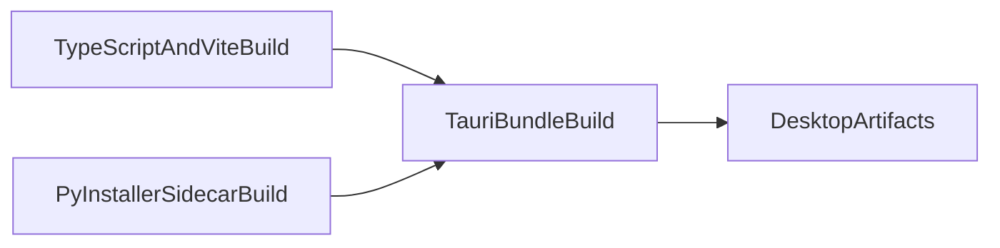

# Build and Release

This guide documents how frontend assets, Python sidecar binaries, and Tauri bundles are produced.

## Build pipeline overview

## Core scripts

- `npm run build`: TypeScript compile + Vite build.
- `npm run build:python`: Build Python sidecar for current platform.
- `npm run tauri:build`: Build desktop app and move outputs.
- `npm run dist`: Combined frontend + sidecar + Tauri packaging flow.

## Sidecar behavior

- Python sidecar is built from `server/build.py`.
- Tauri bundle references sidecar via `externalBin` (`resources/flask-api`) in [`../src-tauri/tauri.conf.json`](../src-tauri/tauri.conf.json).
- Keep sidecar naming and location consistent with Rust startup logic.

## Recommended local release validation

1. Run `npm run build:python`.
2. Run `npm run check:desktop-ga` (sidecar artifact checks).
3. Run `npm run tauri:build` (or `npm run dist` for full path).
4. Smoke test launch of packaged app if possible.

## CI and release workflows

- CI quality and smoke jobs: [`../.github/workflows/ci.yml`](../.github/workflows/ci.yml)
- Tag-driven release build: [`../.github/workflows/build.yml`](../.github/workflows/build.yml)

## Common build failure classes

- Python dependencies not installed or interpreter mismatch.
- Sidecar executable missing or wrong name.
- Rust/toolchain setup issues on clean environments.
- OS-specific system package requirements missing in Linux CI.

For targeted troubleshooting steps, see [`troubleshooting.md`](./troubleshooting.md).
